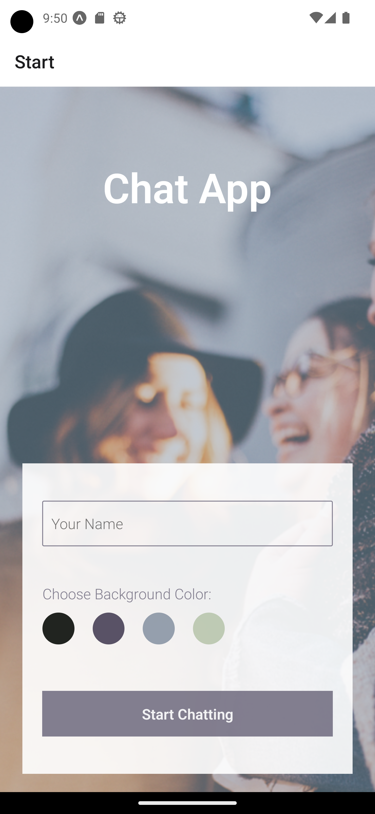
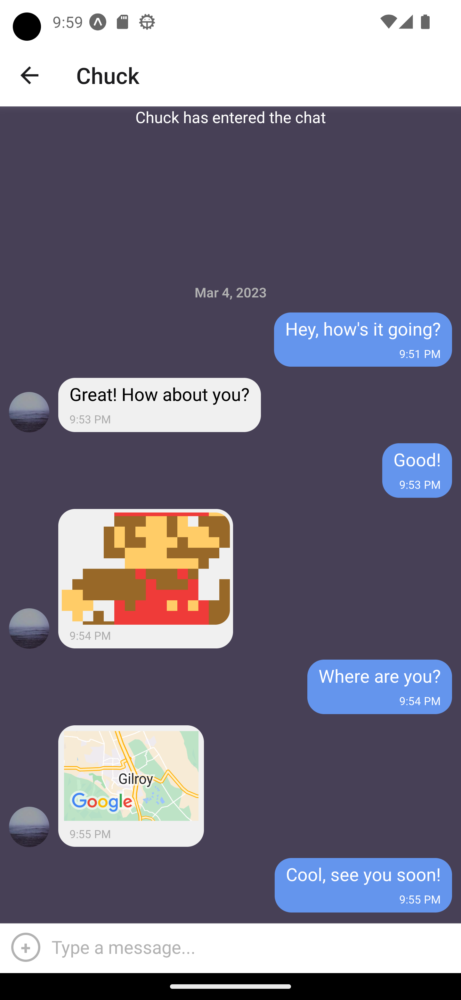

# Chat App

## About

Chat App (as the name implies) is a simple chat app for mobile devices (iOS & Android) written with React Native, and developed using Expo. The app provides users with a chat interface and options to share images and their location. Google Firebase has been implemented for anonymous user authentication and cloud storage of messages and images. Users can also use the app offline to view previous conversations stored locally.

<pre>
  
</pre>

## Dependencies

<pre>
"@react-native-async-storage/async-storage": "~1.17.3",
"@react-native-community/masked-view": "^0.1.11",
"@react-navigation/native": "^6.1.4",
"@react-navigation/stack": "^6.3.13",
"expo": "~47.0.12",
"expo-status-bar": "~1.4.2",
"firebase": "^8.1.0",
"react": "18.1.0",
"react-native": "0.70.5",
"react-native-gesture-handler": "~2.8.0",
"react-native-gifted-chat": "^1.1.1",
"react-native-reanimated": "~2.12.0",
"react-native-safe-area-context": "4.4.1",
"react-native-screens": "~3.18.0",
"react-navigation": "^4.4.4",
"@react-native-community/netinfo": "9.3.5",
"expo-permissions": "~14.0.0",
"expo-image-picker": "~14.0.2",
"react-native-action-sheet": "^2.2.0",
"expo-camera": "~13.1.0",
"expo-location": "~15.0.1",
"react-native-maps": "1.3.2"
</pre>

### Installation Instructions

In order to run this application, you will need an Android or iOS emulator (Android Studio for Android, XCode for iOS). Alternatively, you can run this application on actual hardware with the Expo Go mobile app available for Android and iOS on their respective app stores. You will need to create a free account at https://expo.dev/.

#### Setting up the Developer Environment

- Install Expo CLI globally: `npm install -g expo-cli` or `yarn global add expo-cli`
- Clone the repo: `git clone https://github.com/mpschirle1/chat-app`
- Install dependencies: `npm install` or `yarn`
- In your terminal log in with your Expo credentials: `npx expo login`
- Start the development server: `npx expo start`
